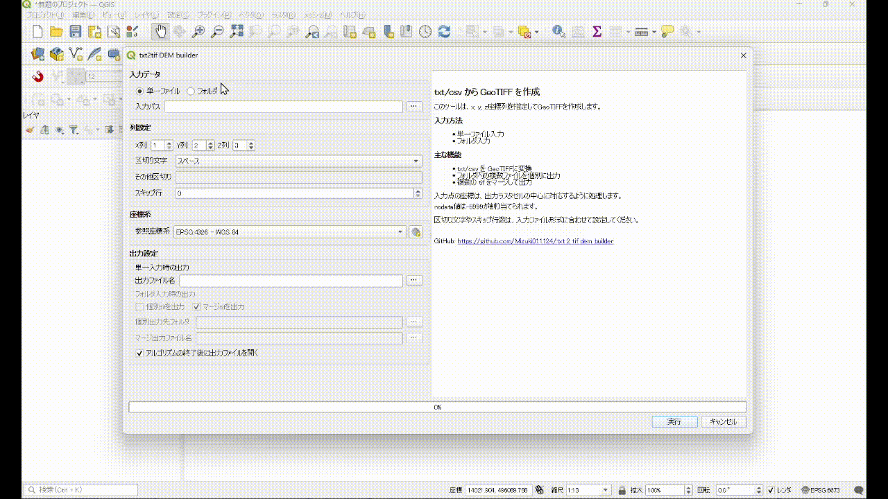
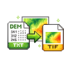
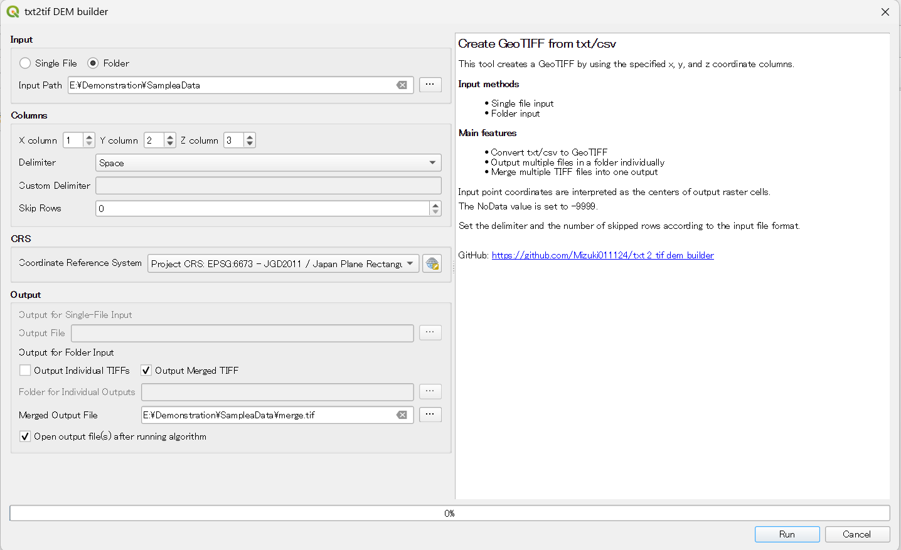

# txt_2_tif_dem_builder v1.0.0

G空間情報センター等でダウンロードできるtxt/csv形式のDEMを、GeoTIFF形式に変換するQGISプラグインです。 
This plugin converts DEM data in txt/csv format (e.g., from the Geospatial Information Center) to GeoTIFF.

## 使い方

1. プラグインをインストールすると、以下のアイコンがツールバーに表示されます。クリックするとツールが起動します。

2. 以下のパラメータを設定します。

- **入力データ**
  - 単一のtxt/csvファイル  
  - または 複数ファイルを含むフォルダ

- **列設定**
  - X, Y, Z 座標列
  - 区切り文字
  - スキップ行数（ヘッダーなど）

- **出力設定**
  - 出力座標系
  - 単一ファイル入力時：出力ファイル名を指定
  - フォルダ入力時：
    - 「個別tifを出力」
    - 「マージtifを出力」
    を選択し、それぞれ出力先を指定

3. 「実行」をクリック

## 留意事項

- 入力点の座標は、出力ラスタセルの**中心**に対応するよう処理されます。
- NoData値は `-9999` が割り当てられます。
- 入力ファイルの形式（区切り文字・列構成）に応じて、適切にパラメータを設定してください。

## Author

Mizuki TAKIGAWA